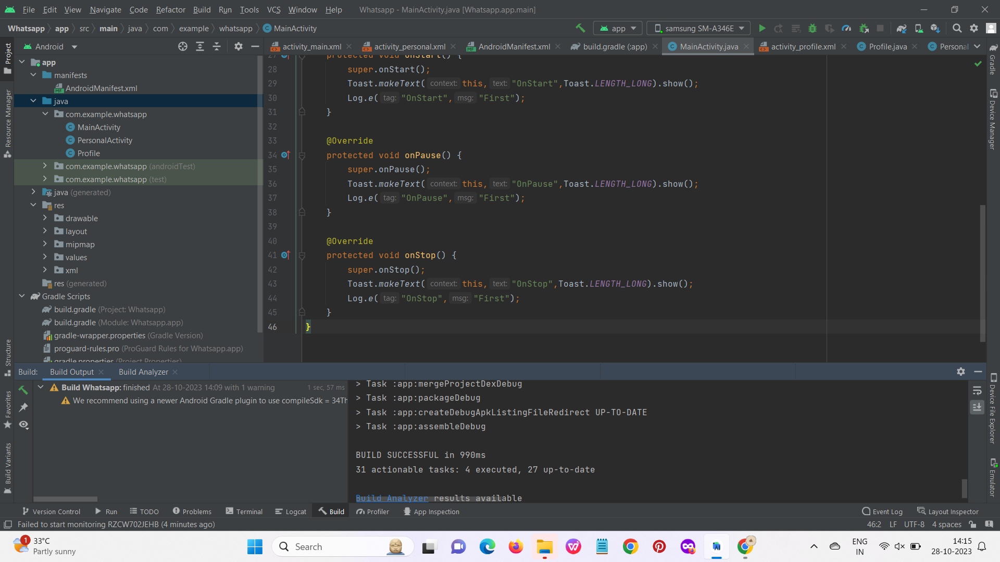
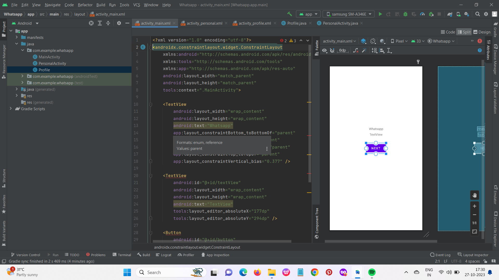
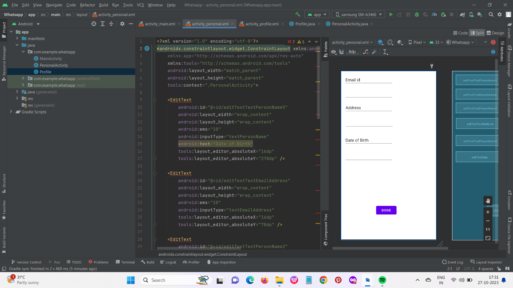
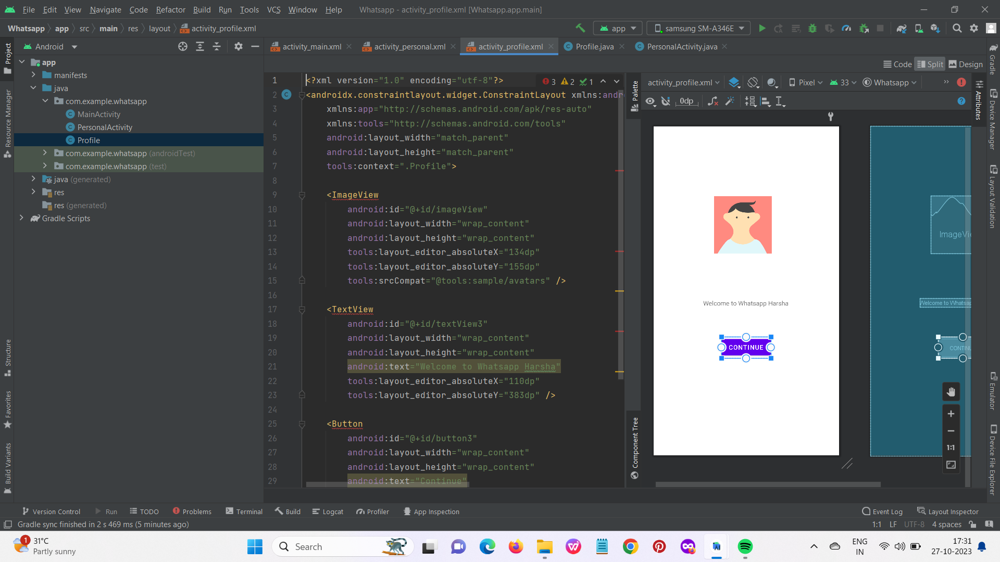
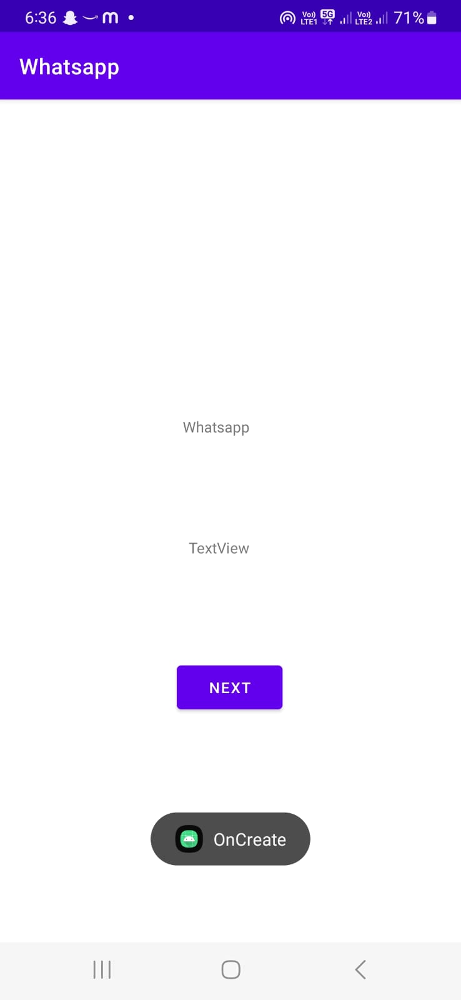
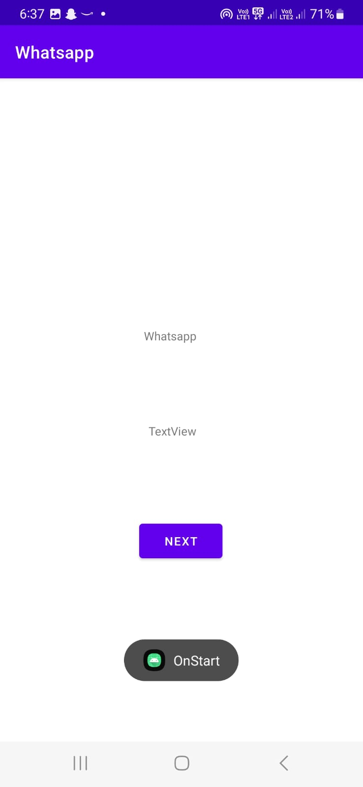
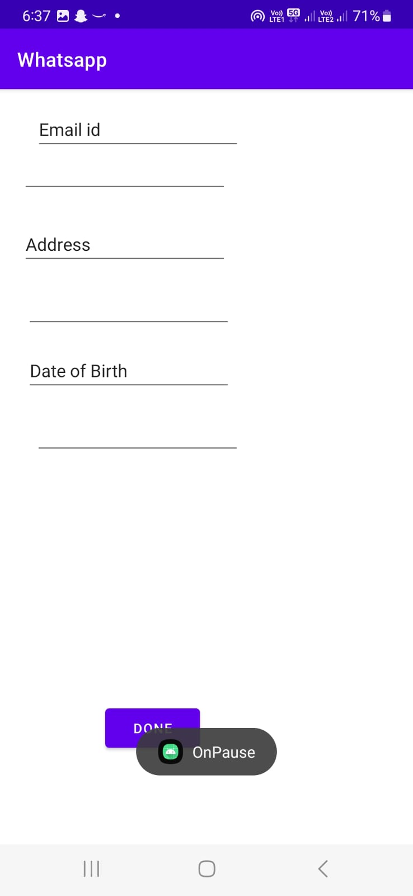
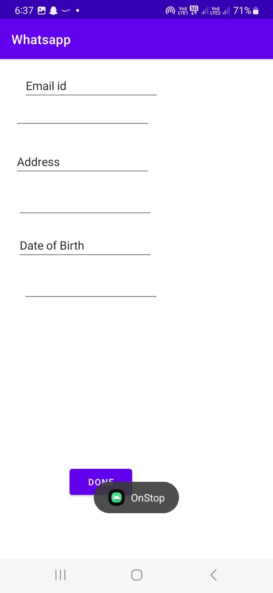
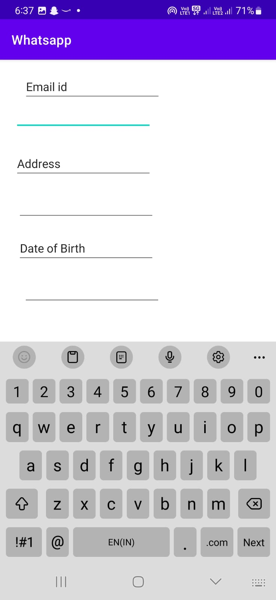

# FirstApp
## Workshop Dates 27.10.23 - 28.10.23
Hands on Mobile App Development

Company Name : IVY Mobility

Resource Person: Mr V.Murugan MCA.,MBA (Technical Architect).

## Lessons Learnt 
1.Introduction to Mobile App Development.

2.Android Environment Setup and Architecture.

3.Creating Your First Android App.

4.Android User Interface (UI) Layouts and Control.

5.Designing simple application.

6.Debugging and Deployment.

## Event Poster


## Program

In mainactivity.java
```
package com.example.whatsapp;

import androidx.appcompat.app.AppCompatActivity;

import android.content.Intent;
import android.os.Bundle;
import android.util.Log;
import android.view.View;
import android.widget.Toast;

public class MainActivity extends AppCompatActivity {

    @Override
    protected void onCreate(Bundle savedInstanceState) {
        super.onCreate(savedInstanceState);
        setContentView(R.layout.activity_main);
        Toast.makeText(this,"OnCreate",Toast.LENGTH_LONG).show();
        Log.e("OnCreate","First");
    }

    public void NextPage(View view){
        Intent i = new Intent(getApplicationContext(),PersonalActivity.class);
        startActivity(i);
    }

    @Override
    protected void onStart() {
        super.onStart();
        Toast.makeText(this,"OnStart",Toast.LENGTH_LONG).show();
        Log.e("OnStart","First");
    }

    @Override
    protected void onPause() {
        super.onPause();
        Toast.makeText(this,"OnPause",Toast.LENGTH_LONG).show();
        Log.e("OnPause","First");
    }

    @Override
    protected void onStop() {
        super.onStop();
        Toast.makeText(this,"OnStop",Toast.LENGTH_LONG).show();
        Log.e("OnStop","First");
    }
}
```



In activity_main.xml
```
<?xml version="1.0" encoding="utf-8"?>
<androidx.constraintlayout.widget.ConstraintLayout
    xmlns:android="http://schemas.android.com/apk/res/android"
    xmlns:tools="http://schemas.android.com/tools"
    xmlns:app="http://schemas.android.com/apk/res-auto"
    android:layout_width="match_parent"
    android:layout_height="match_parent"
    tools:context=".MainActivity">

    <TextView
        android:id="@+id/textView4"
        android:layout_width="wrap_content"
        android:layout_height="wrap_content"
        android:layout_marginTop="180dp"
        android:layout_marginEnd="176dp"
        android:text="Whatsapp"
        app:layout_constraintBottom_toTopOf="@+id/textView5"
        app:layout_constraintEnd_toEndOf="parent"
        app:layout_constraintTop_toTopOf="parent" />

    <TextView
        android:id="@+id/textView5"
        android:layout_width="wrap_content"
        android:layout_height="wrap_content"
        android:layout_marginEnd="176dp"
        android:layout_marginBottom="84dp"
        android:text="TextView"
        app:layout_constraintBottom_toTopOf="@+id/button4"
        app:layout_constraintEnd_toEndOf="parent" />

    <Button
        android:id="@+id/button4"
        android:layout_width="wrap_content"
        android:layout_height="wrap_content"
        android:layout_marginBottom="188dp"
        android:onClick="NextPage"
        android:text="Next"
        app:layout_constraintBottom_toBottomOf="parent"
        app:layout_constraintEnd_toEndOf="parent"
        app:layout_constraintHorizontal_bias="0.498"
        app:layout_constraintStart_toStartOf="parent" />
</androidx.constraintlayout.widget.ConstraintLayout>
```

In activity_personal.xml
```
<?xml version="1.0" encoding="utf-8"?>
<androidx.constraintlayout.widget.ConstraintLayout xmlns:android="http://schemas.android.com/apk/res/android"
    xmlns:app="http://schemas.android.com/apk/res-auto"
    xmlns:tools="http://schemas.android.com/tools"
    android:layout_width="match_parent"
    android:layout_height="match_parent"
    tools:context=".PersonalActivity">

    <EditText
        android:id="@+id/editTextTextPersonName5"
        android:layout_width="wrap_content"
        android:layout_height="wrap_content"
        android:layout_marginEnd="168dp"
        android:layout_marginBottom="16dp"
        android:ems="10"
        android:inputType="textPersonName"
        android:text="Date of Birth"
        app:layout_constraintBottom_toTopOf="@+id/editTextDate"
        app:layout_constraintEnd_toEndOf="parent" />

    <EditText
        android:id="@+id/editTextTextEmailAddress"
        android:layout_width="wrap_content"
        android:layout_height="wrap_content"
        android:layout_marginEnd="172dp"
        android:layout_marginBottom="24dp"
        android:ems="10"
        android:inputType="textEmailAddress"
        app:layout_constraintBottom_toTopOf="@+id/editTextTextPersonName3"
        app:layout_constraintEnd_toEndOf="parent" />

    <EditText
        android:id="@+id/editTextTextPersonName2"
        android:layout_width="wrap_content"
        android:layout_height="wrap_content"
        android:layout_marginTop="16dp"
        android:ems="10"
        android:inputType="textPersonName"
        android:text="Email id"
        app:layout_constraintBottom_toTopOf="@+id/editTextTextEmailAddress"
        app:layout_constraintEnd_toEndOf="parent"
        app:layout_constraintHorizontal_bias="0.169"
        app:layout_constraintStart_toStartOf="parent"
        app:layout_constraintTop_toTopOf="parent"
        app:layout_constraintVertical_bias="0.0" />

    <EditText
        android:id="@+id/editTextTextPersonName3"
        android:layout_width="wrap_content"
        android:layout_height="wrap_content"
        android:layout_marginEnd="172dp"
        android:layout_marginBottom="16dp"
        android:ems="10"
        android:inputType="textPersonName"
        android:text="Address"
        app:layout_constraintBottom_toTopOf="@+id/editTextTextMultiLine"
        app:layout_constraintEnd_toEndOf="parent" />

    <EditText
        android:id="@+id/editTextTextMultiLine"
        android:layout_width="wrap_content"
        android:layout_height="wrap_content"
        android:layout_marginEnd="168dp"
        android:layout_marginBottom="16dp"
        android:ems="10"
        android:gravity="start|top"
        android:inputType="textMultiLine"
        app:layout_constraintBottom_toTopOf="@+id/editTextTextPersonName5"
        app:layout_constraintEnd_toEndOf="parent" />

    <EditText
        android:id="@+id/editTextDate"
        android:layout_width="wrap_content"
        android:layout_height="wrap_content"
        android:layout_marginEnd="160dp"
        android:layout_marginBottom="228dp"
        android:ems="10"
        android:inputType="date"
        app:layout_constraintBottom_toTopOf="@+id/button2"
        app:layout_constraintEnd_toEndOf="parent" />

    <Button
        android:id="@+id/button2"
        android:layout_width="wrap_content"
        android:layout_height="wrap_content"
        android:layout_marginBottom="84dp"
        android:text="Done"
        app:layout_constraintBottom_toBottomOf="parent"
        app:layout_constraintEnd_toEndOf="parent"
        app:layout_constraintHorizontal_bias="0.331"
        app:layout_constraintStart_toStartOf="parent" />

</androidx.constraintlayout.widget.ConstraintLayout>
```

In activity_profile.xml
```
<?xml version="1.0" encoding="utf-8"?>
<androidx.constraintlayout.widget.ConstraintLayout xmlns:android="http://schemas.android.com/apk/res/android"
    xmlns:app="http://schemas.android.com/apk/res-auto"
    xmlns:tools="http://schemas.android.com/tools"
    android:layout_width="match_parent"
    android:layout_height="match_parent"
    tools:context=".Profile">

    <ImageView
        android:id="@+id/imageView"
        android:layout_width="wrap_content"
        android:layout_height="wrap_content"
        app:layout_constraintBottom_toTopOf="@+id/textView3"
        app:layout_constraintEnd_toEndOf="parent"
        app:layout_constraintStart_toStartOf="parent"
        app:layout_constraintTop_toTopOf="parent"
        tools:srcCompat="@tools:sample/avatars" />

    <TextView
        android:id="@+id/textView3"
        android:layout_width="wrap_content"
        android:layout_height="wrap_content"
        android:layout_marginBottom="56dp"
        android:text="Welcome to Whatsapp Harsha"
        app:layout_constraintBottom_toTopOf="@+id/button3"
        app:layout_constraintEnd_toEndOf="parent"
        app:layout_constraintHorizontal_bias="0.497"
        app:layout_constraintStart_toStartOf="parent" />

    <Button
        android:id="@+id/button3"
        android:layout_width="wrap_content"
        android:layout_height="wrap_content"
        android:layout_marginBottom="84dp"
        android:text="Continue"
        app:iconTint="#000000"
        app:layout_constraintBottom_toBottomOf="parent"
        app:layout_constraintEnd_toEndOf="parent"
        app:layout_constraintHorizontal_bias="0.498"
        app:layout_constraintStart_toStartOf="parent" />

</androidx.constraintlayout.widget.ConstraintLayout>
```

## Output on Pixel 4 API 33





## Output on Samsung Galaxy A34





